# 实验报告

###  开发环境

* Ubuntu 16.04
* GO
* VSCode
* GitHub


---

### 实验目的

CLI（Command Line Interface）实用程序是Linux下应用开发的基础。正确的编写命令行程序让应用与操作系统融为一体，通过shell或script使得应用获得最大的灵活性与开发效率。Linux提供了cat、ls、copy等命令与操作系统交互；go语言提供一组实用程序完成从编码、编译、库管理、产品发布全过程支持；容器服务如docker、k8s提供了大量实用程序支撑云服务的开发、部署、监控、访问等管理任务；git、npm等都是大家比较熟悉的工具。尽管操作系统与应用系统服务可视化、图形化，但在开发领域，CLI在编程、调试、运维、管理中提供了图形化程序不可替代的灵活性与效率。

### 实验内容

使用 golang 开发 开发 Linux 命令行实用程序 中的 selpg

提示：

1. 请按文档 使用 selpg 章节要求测试你的程序
2. 请使用 pflag 替代 goflag 以满足 Unix 命令行规范， 参考：Golang之使用Flag和Pflag
3. golang 文件读写、读环境变量，请自己查 os 包
4. “-dXXX” 实现，请自己查 os/exec 库，例如案例 Command，管理子进程的标准输入和输出通常使用 io.Pipe，具体案例见 Pipe

### 实验过程

在老师提供的资料中有一份[Selpg.c](https://www.ibm.com/developerworks/cn/linux/shell/clutil/selpg.c)的源码，在开始之前先把这份源码读懂会对实验的帮助很大。准备工作完成后创建main.go文件，参照源码给出selpg参数结构体的定义如下
```go
type Selpg struct { //定义selpg所有参数的结构体
	start_page  int    //开始页号
	end_page    int    //结束页号
	in_filename string //输入文件名
	page_len    int    //页面长度
	page_type   bool   //分割页面的方式
	print_dest  string //目标打印机
}
```
在main函数中创建selpg结构体，并调用了两个函数process_args和process_input，前者用于处理selpg程序收到的参数，后者用于完成文件的输入输出，代码的逻辑结构简洁明了。
```go
func main() {
	var selpg Selpg       //创建结构体
	process_args(&selpg)  //处理参数
	process_input(&selpg) //输入输出
}
```

#### process_args
在process_args函数中主要逻辑分为两部分：获取参数和参数合法性检查。对于获取参数部分调用了get_args函数，利用flag包绑定selpg中的各个参数。其中page_len的默认值按照实验要求应该设为72，但为了方便后续测试而将其设为7。值得注意的是对于in_filename参数需要做特殊处理，因为该参数属于non-flags参数，需要主动到flag的args列表中查找。
```go
func get_args(selpg *Selpg) { //获取参数
	if selpg == nil { //selpg为空
		fmt.Fprintf(os.Stderr, "\nSlepg can not be nil\n\n")
		os.Exit(1)
	}

	//绑定参数
	flag.IntVar(&selpg.start_page, "s", -1, "Start Page")
	flag.IntVar(&selpg.end_page, "e", -1, "End Page")
	flag.IntVar(&selpg.page_len, "l", 7, "Lines Per Page") //便于测试
	//flag.IntVar(&selpg.page_len, "l", 72, "Lines Per Page")
	flag.BoolVar(&selpg.page_type, "f", false, "Delimited By Form Feeds")
	flag.StringVar(&selpg.print_dest, "d", "", "Specify The Printer")
	flag.Parse()

	//处理non-flag参数，若存在则为输入文件名
	if len(flag.Args()) > 0 {
		selpg.in_filename = flag.Args()[0]
	} else {
		selpg.in_filename = ""
	}
}
```
获取参数后需要对参数的合法性进行检查：开始页和结束页是必需参数且必须为正数、开始页不得大于结束页、页面长度必须为正数。
```go
if selpg.start_page == -1 || selpg.end_page == -1 { //没有输入开始页和结束页
    fmt.Fprintf(os.Stderr, "\nStart_Page and End_Page are needed\n\n")
    os.Exit(2)
} else if selpg.start_page <= 0 || selpg.end_page <= 0 || selpg.start_page > selpg.end_page || selpg.page_len <= 0 { //参数不合法
    fmt.Fprintf(os.Stderr, "\nStart_Page or End_Page or Page_Len are invalid\n\n")
    os.Exit(3)
}
```

#### process_input
首先确定输出文件，缺省的情况下为标准输入（键盘或重定向），否则为对应文件名文件。
```go
//确定输入文件
var fin *os.File

if selpg.in_filename == "" { //文件名为空
    fin = os.Stdin
} else { //文件名非空
    var err error
    fin, err = os.Open(selpg.in_filename)

    if err != nil {
        fmt.Fprintf(os.Stderr, "\ncan not open file %s\n\n", selpg.in_filename)
        os.Exit(4)
    }
}
```
然后确定输出文件，缺省的情况下为标准输出（屏幕或重定向），否则需要输出到目标打印机执行打印指令。可以通过os/exec包创建子进程执行lp指令，并建立StdinPipe将当前输出作为子进程的输入（由于没有打印机所以执行lp指令会报错，可以使用cat指令进行测试）
```go
//确定输出文件
var fout io.WriteCloser

if selpg.print_dest == "" { //打印目的地为空
    fout = os.Stdout
} else { //打印目的地非空
    cmd := exec.Command("lp -d " + selpg.print_dest)
    //cmd := exec.Command("cat") //可用于测试
    var err error
    fout, err = cmd.StdinPipe() //将当前的输出作为cmd的输入
    if err != nil {
        fmt.Fprintf(os.Stderr, "\ncan not open pipe\n\n")
        os.Exit(5)
    }
    cmd.Stdout = os.Stdout
    cmd.Stderr = os.Stderr
    err = cmd.Start() //开始执行
    if err != nil {
        fmt.Fprintf(cmd.Stderr, "\nlp: The printer or class does not exist\n\n")
        os.Exit(5)
    }
}
```
接下来打印页，根据page_type分为两种情况，一种是按照page_len确定页的大小。page_len表示每一页包含的行数，因此将输入文件按照page_len分割成页，并将对应区间的页内容写入到输出文件中。
```go
if !selpg.page_type { //按照page_len确定页
    line_ctr := 0
    page_ctr := 1
    buf := bufio.NewReader(fin)

    for true {
        line, err := buf.ReadString('\n')
        if err != nil {
            if err == io.EOF { //读至文件末尾
                break
            }
            fmt.Fprintf(os.Stderr, "\nread file error\n\n")
            os.Exit(6)
        }

        line_ctr++
        if line_ctr > selpg.page_len { //读够一页
            page_ctr++
            line_ctr = 1
        }
        if (page_ctr >= selpg.start_page) && (page_ctr <= selpg.end_page) { //写入
            _, err := fout.Write([]byte(line))
            if err != nil {
                fmt.Fprintf(os.Stderr, "\nwrite file error\n\n")
                os.Exit(7)
            }
        } else if page_ctr > selpg.end_page {
            break
        }
    }
}
```
另外一种情况是按照换页符来分割页，一个换页符代表一页，以此来分割输入文件。由于txt文件中没有换页符，可以将换页符换成换行符便于测试。
```go
else { //按照换页符确定页
    page_ctr := 0
    buf := bufio.NewReader(fin)

    for true {
        //page, err := buf.ReadString('\f')
        page, err := buf.ReadString('\n') //便于测试
        if err != nil {
            if err == io.EOF {
                break
            }
            fmt.Fprintf(os.Stderr, "\nread file error\n\n")
            os.Exit(6)
        }
        page_ctr++

        if (page_ctr >= selpg.start_page) && (page_ctr <= selpg.end_page) { //写入
            _, err := fout.Write([]byte(page))
            if err != nil {
                fmt.Fprintf(os.Stderr, "\nwrite file error\n\n")
                os.Exit(7)
            }
        } else if page_ctr > selpg.end_page {
            break
        }
    }
}
```

### 实验结果
input.txt包含数字1~100，每个数字占一行，作为测试用输入文件；output.txt作为测试用输出文件；error.txt作为测试用错误文件。（注意：为了方便测试，page_len的默认值设为了7；-f原来是根据换页符换页改为根据换行符换页）

1. selpg -s1 -e1 input_file

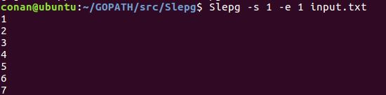

2. selpg -s1 -e1 < input_file

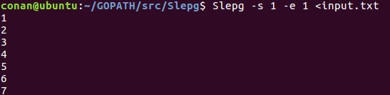

3. other_command | selpg -s10 -e20

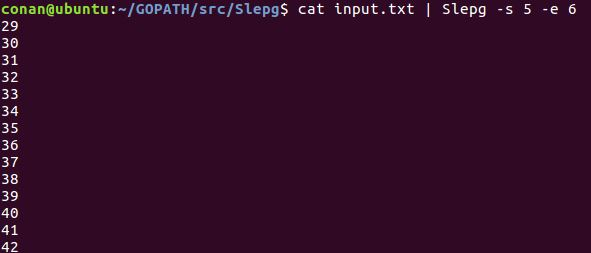

4. selpg -s10 -e20 input_file >output_file

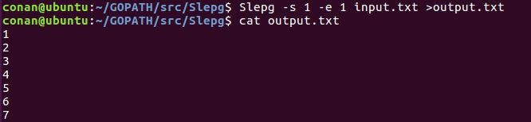

5. selpg -s10 -e20 input_file 2>error_file

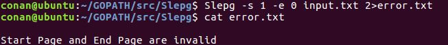

6. selpg -s10 -e20 input_file >output_file 2>error_file

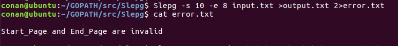

7. selpg -s10 -e20 input_file >output_file 2>/dev/null

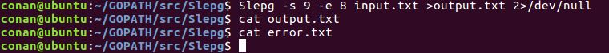

8. selpg -s10 -e20 input_file >/dev/null

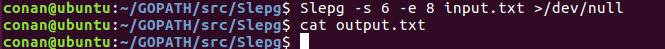

9. selpg -s10 -e20 input_file | other_command

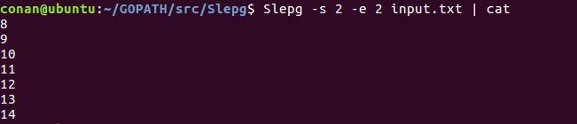

10. selpg -s10 -e20 input_file 2>error_file | other_command

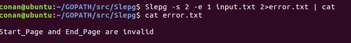

11. selpg -s10 -e20 -l66 input_file

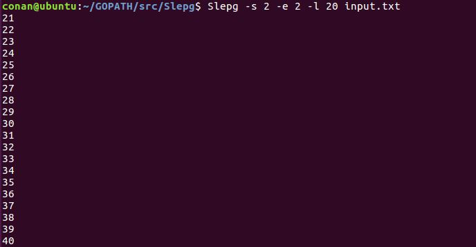

12. selpg -s10 -e20 -f input_file

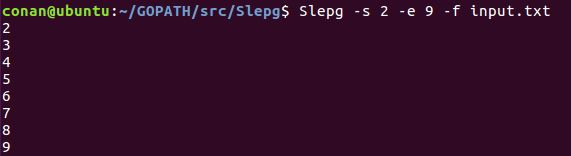

13. selpg -s10 -e20 -dlp1 input_file

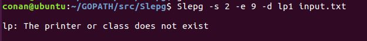

14. selpg -s10 -e20 input_file > output_file 2>error_file &

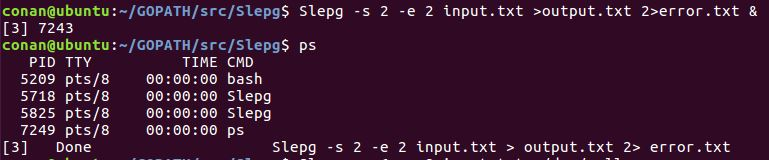
